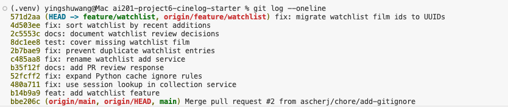

# PR Response Doc — CineLog Watchlist Feature

## AI Usage
<!-- Fill in at the end — how you used AI tools during this project -->

## Comment 1 — Rename
**What I did:** I first compared `services/watchlist_service.py` with `add_to_collection()` in `services/collection_service.py` and confirmed that the project uses the `verb_to_noun` convention. I then ran a project-wide `rg` search for both `save_to_watchlist` and `add_to_watchlist`. That identified the definition in `services/watchlist_service.py` plus the import and call site in `routes/watchlist/watchlist.py`. I renamed the function to `add_to_watchlist()` and updated both route references.
**How I verified:** I repeated the project-wide `rg -n "save_to_watchlist|add_to_watchlist" .` search. The only code references were the renamed definition, route import, and route call; there were no remaining code references to `save_to_watchlist`. I also ran the full test suite, which passed all four tests that existed at that point.

## Comment 2 — Deduplication
**What I did:** I used `add_to_collection()` in `services/collection_service.py` as the implementation model. Following its sequence, `add_to_watchlist()` first verifies that the film exists, then queries `WatchlistEntry` using both `user_id` and `film_id`, and raises a dedicated `AlreadyInWatchlistError` before creating or committing another entry. This preserves the collection service's explicit, domain-specific error behavior.
**How I verified:** In an isolated in-memory database, I created one user and one film, called `add_to_watchlist()` twice with the same IDs, and asserted that the second call raised `AlreadyInWatchlistError`. I then queried `WatchlistEntry` with the same `user_id` and `film_id` and confirmed the count remained exactly one. Finally, I ran the existing full test suite and all four tests passed.

## Comment 3 — Missing test
**What I did:** I used `test_add_to_collection_nonexistent_film_raises()` in `tests/test_collection.py` as the direct model. I created `tests/test_watchlist.py` with the same in-memory application/database fixture, the same sample-user fixture structure, the same fixed nonexistent film ID, and the same `with pytest.raises(FilmNotFoundError)` assertion inside an application context. The equivalent watchlist test is named `test_add_to_watchlist_nonexistent_film_raises()`.
**How I verified:** Ran `.venv/bin/pytest tests/test_watchlist.py -v`; the new test passed. The system-level `pytest` could not collect the test because that interpreter does not have Flask installed, so I explicitly used the project's virtual environment.

## Comment 4 — Default visibility
**My position:** I would keep `public=True` as the default for watchlist entries. This should be an intentional product default, not merely the value that happened to be in the model.
**Reasoning:** CineLog is a film-discovery and sharing product, so I am optimizing for users who expect their saved films to contribute immediately to a visible profile and to conversations or recommendations with other users. A public default removes the extra setup step of publishing each entry and avoids the common outcome where a social feature appears empty because users never discover or change a visibility control. The `public` field still allows a user to make an entry private when they do not want to share it. For this choice to be responsible, the UI should clearly state the default at the time a film is added and provide an easy way to change it; the default should not be hidden from the user.
**Tradeoff acknowledged:** Defaulting to private would better follow a privacy-first principle and would protect users who may not realize that a watchlist can reveal personal interests. It would also avoid accidental disclosure, which is more difficult to undo than a missed sharing opportunity. The cost is additional friction: users who joined CineLog to share and discover films would have to opt in for every entry or find a bulk visibility setting, and many entries could remain private unintentionally. I accept the privacy cost of the public default only with clear disclosure and accessible controls; if the product cannot provide those safeguards, I would change the default to private.

## Comment 5 — Sort order
**My position:** I agree with the maintainer and changed the default watchlist order from alphabetical by film title to `date_added` descending, so the most recently added film appears first.
**Reasoning:** A watchlist primarily records future viewing intent. Immediately after saving a film, the most common next action is to confirm it was saved or return to the films the user was recently considering. Recency order supports that behavior directly and preserves the meaningful sequence in which the user built the list. It also matches `get_collection()`, which already presents newly added collection entries first, so users encounter one consistent default ordering across both personal lists. Alphabetical order is useful when locating a known title, but it is a less informative default because it discards the user's recent activity; search or an explicit title-sort control would serve that lookup behavior better.
**Engagement with reviewer's point:** The maintainer argued that most users want to see what they added recently. I find that persuasive because a newly saved item would otherwise jump to an unrelated location based on its title, making the save action harder to verify and hiding current viewing priorities among older entries. The tradeoff is that scanning a long watchlist for a particular title becomes less predictable. I accept that cost for the default view, while recognizing that alphabetical sorting should remain a useful optional view if the product later supports selectable sort modes.

## Comment 6 — Rebase
**What conflicted:** Rebasing `feature/watchlist` onto `origin/main` produced add/add and content conflicts in `.gitignore` because both branches introduced Python cache, database, and virtual-environment rules. There was also a semantic model conflict that Git could not flag with conflict markers: `main` had migrated `Film.id` and `CollectionEntry.film_id` from integers to 36-character UUID strings, while the rebased watchlist service and route documentation still described integer film IDs, and the rebased `models.py` no longer contained `WatchlistEntry`.
**How I resolved it:** I merged the `.gitignore` rules so the database, virtual environments, `__pycache__`, the broader Python cache pattern, compiled Python files, and `.pytest_cache` remain ignored. For the model integration, I restored `WatchlistEntry` using a UUID primary key and a `db.String(36)` foreign key to `film.id`, added its User and Film relationships, and added a database-level unique constraint for `(user_id, film_id)`. I updated the watchlist service docstring and route request documentation to describe `film_id` as a UUID string. The service continues to use `db.session.get(Film, film_id)`, which now receives the UUID value directly.
**How I verified no conflict remains:** I searched the watchlist model, service, route, and test for integer or pre-refactor film-ID references and found none. I created films with generated UUIDs in an in-memory database, added them to a watchlist, and confirmed `get_watchlist()` returned the related films in newest-first order. The targeted watchlist test passed, the full suite passed all five tests, `git status` contained no unmerged paths, and `git rev-list --merges origin/main..HEAD` returned no commits, confirming the rebased feature history contains no merge commits.

## Commit History Screenshot



## PR Description

## Feature overview

This PR adds a watchlist for films a user wants to watch later. It introduces UUID-backed `WatchlistEntry` records, registers watchlist REST endpoints, prevents the same user from adding the same film twice, returns film details with watchlist metadata, and adds service coverage for nonexistent film IDs.

## Design decisions

- **Default visibility:** New watchlist entries default to `public=True`. CineLog is designed around film discovery and sharing, so this default makes saved films immediately useful on a user's visible profile. This choice assumes the UI clearly discloses the default and makes privacy controls easy to use; without those safeguards, a private default would be safer.
- **Default sort order:** Watchlists are sorted by `date_added` descending, with the newest additions first. This makes a recent save easy to confirm, reflects the user's current viewing intent, and matches the existing collection ordering. Alphabetical order remains a good candidate for a future optional sort mode.

## Manual testing

1. Create and activate a virtual environment, then install the dependencies:

   ```bash
   python -m venv .venv
   source .venv/bin/activate
   pip install -r requirements.txt
   ```

2. Seed one user and two films from the Flask shell:

   ```bash
   flask --app app shell
   ```

   ```python
   from app import db
   from models import User, Film

   user = User(username="manualtester", email="manual@example.com")
   first_film = Film(title="Alien", year=1979, genre="Horror")
   second_film = Film(title="Arrival", year=2016, genre="Sci-Fi")
   db.session.add_all([user, first_film, second_film])
   db.session.commit()
   print(user.id, first_film.id, second_film.id)
   exit()
   ```

3. Save the printed UUIDs as `USER_ID`, `FIRST_FILM_ID`, and `SECOND_FILM_ID`, then start the server in one terminal:

   ```bash
   export USER_ID="<printed-user-uuid>"
   export FIRST_FILM_ID="<printed-alien-uuid>"
   export SECOND_FILM_ID="<printed-arrival-uuid>"
   flask --app app run
   ```

4. In another terminal, repeat the three `export` commands with the same UUIDs. Then add the first film to the watchlist and confirm the response is `201 Created` with UUID `film_id` and `"public": true`:

   ```bash
   curl -i -X POST "http://127.0.0.1:5000/watchlist/${USER_ID}/add" \
     -H "Content-Type: application/json" \
     -d "{\"film_id\":\"${FIRST_FILM_ID}\"}"
   ```

5. Add the second film using the same endpoint and its UUID:

   ```bash
   curl -i -X POST "http://127.0.0.1:5000/watchlist/${USER_ID}/add" \
     -H "Content-Type: application/json" \
     -d "{\"film_id\":\"${SECOND_FILM_ID}\"}"
   ```

6. Retrieve the watchlist and confirm `Arrival` appears before `Alien`, demonstrating newest-first ordering:

   ```bash
   curl "http://127.0.0.1:5000/watchlist/${USER_ID}"
   ```

7. Run the automated tests:

   ```bash
   pytest tests/test_watchlist.py -v
   pytest -q
   ```
